## Important Papers and Resources

- **[Spatio-Temporal Self-Attention Network for Fire Detection and Segmentation in Video Surveillance ](https://ieeexplore.ieee.org/abstract/document/9635806/references#references)**

- **[Forest Fire Segmentation via Temporal Transformer from Aerial Images](https://www.mdpi.com/1999-4907/14/3/563)**

- **[Spatiotemporal CNN for Video Object Segmentation](https://openaccess.thecvf.com/content_CVPR_2019/papers/Xu_Spatiotemporal_CNN_for_Video_Object_Segmentation_CVPR_2019_paper.pdf)**

- **[Aerial Imagery Pile burn detection using Deep Learning: the FLAME dataset](https://arxiv.org/pdf/2012.14036)**

- **[A Real-time Fire Segmentation Method Based on A Deep Learning Approach](https://github.com/maidacundo/real-time-fire-segmentation-deep-learning/blob/main/docs/A%20Real-time%20Fire%20Segmentation%20Method%20Based%20on%20A%20Deep%20Learning%20Approach.pdf)**

- **[Google Tuning Playbook](https://github.com/google-research/tuning_playbook?tab=readme-ov-file#who-is-this-document-for)**

- **[Lucid Data Dreaming for Object Tracking](https://pure.mpg.de/rest/items/item_2493068/component/file_2493067/content)**

- **[Pyramid Scene Parsing Network](https://openaccess.thecvf.com/content_cvpr_2017/papers/Zhao_Pyramid_Scene_Parsing_CVPR_2017_paper.pdf)**

 

## Important Datasets

- [FLAME Dataset](https://ieee-dataport.org/open-access/flame-dataset-aerial-imagery-pile-burn-detection-using-drones-uavs) (Joint)

- [DAVIS Datasets](https://davischallenge.org/davis2017/code.htmlx) (Joint)

- [ILSVRC](https://image-net.org/challenges/LSVRC/2017/) (Temporal)

- [MSRA10K](https://mmcheng.net/msra10k/) (Segmentation)

- [VOC2012](http://host.robots.ox.ac.uk/pascal/VOC/voc2012/) (Segmentation)

- [FIRE Dataset](https://www.kaggle.com/datasets/diversisai/fire-segmentation-image-dataset) (Needs processing, can extract videos manually)

 

## Data Preprocessing

### Segmentation Branch (Original implementation)

Data Augmentation and Normalization

- `RandomCrop` - takes a random crop from the image of a given size in pixels

- `RandomHorizontallyFlip` - Flips the image horizontally with 50%

- `RandomRotate` - Randomly rotate an image with a given degree in range (-n , n)

- `ToTensor()` - Converts image to tensor scaling it to **[0,1]**

- `Normalize()` - Using mean **[0.485, 4.56, 0.406] **and std** [0.229, 0.224, 0.225]**. Those are standard values for ***ImageNet*** Models. Each number is an RGB normalization. We must use those values because the ResNet was pre-trained on the same parameters. Results in the values of **[-1, 1]**

Standard Gradient Based Optimizer

- Has **momentum** of 0.9

- Learning rate for biases **is doubled**, done because they lack **L2 weight Decay**

- Weights use L2 weight Decay:

$$ w \leftarrow w - \alpha \left( \frac{\partial L}{\partial w} + \lambda w \right) $$

- w = weight parameter

- α = learning rate

- LL = loss function

- λ (or `wd`) = weight decay coefficient

- For pre-training `lr` is 0.001, `wd` is 0.0005

- Batch size is 8

### Temporal Branch (Original Implementation) 

Data Augmentation and Normalization

- Some sequences have a chance of appearing ion reverse order with 40%

- `RandomHorizontallyFlip` - Flips the image horizontally with 50%

- `ToTensor()` - Converts np array to tensors because they use diff order of channels

- `Normalize()` - Uses BASIC normalization unlike one for ResNet

Adam Optimizers

- `lr` for discriminator is 1e-4 and for generator is 1e-7

- `wd` for both is 0.0002

### Joint Training (Original Implementation)

- `RandomHorizontallyFlip` - Flips the image horizontally with 50%

- `ScaleNRotate` - Scales the image by a a given range **[0.75, 1.25]**, and rotates it by a given range** [-30, 30]**

- `Normalize()` - Using mean **[0.485, 4.56, 0.406] **and std** [0.229, 0.224, 0.225]**. Those are standard values for ***ImageNet*** Models. Each number is an RGB normalization. We must use those values because the ResNet was pre-trained on the same parameters. Results in the values of **[-1, 1] **only for the frame for segmentation branch

- Use BASIC normalization for images that are under temporal branch

## Metrics Used

- Pixel Accuracy

$$ PA = \frac{\text{Number of correctly classified pixels}}{\text{Total number of pixels}}  $$

$$ PA = \frac{TP + TN}{TP + TN + FP + FN}  $$

- Intersection over Union

$$ IoU = \frac{|A \cap B|}{|A \cup B|} $$

$$ IoU = \frac{TP}{TP + FP + FN} $$

- Dice Loss (F1)

$$ \mathcal{L}_{\text{Dice}} = 1 - \frac{2 \sum_{i} y_{\text{true}, i} \cdot y_{\text{pred}, i} + \epsilon}{\sum_{i} y_{\text{true}, i} + \sum_{i} y_{\text{pred}, i} + \epsilon} $$

## Training Pipeline

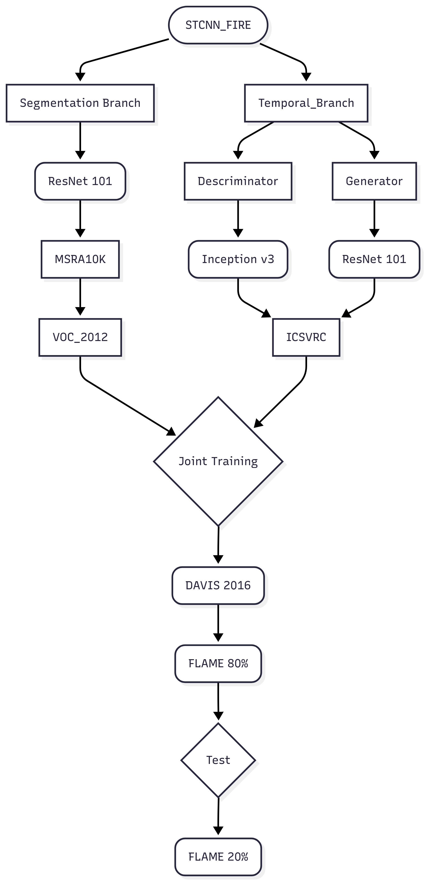

## Ablation Study Diagram

 

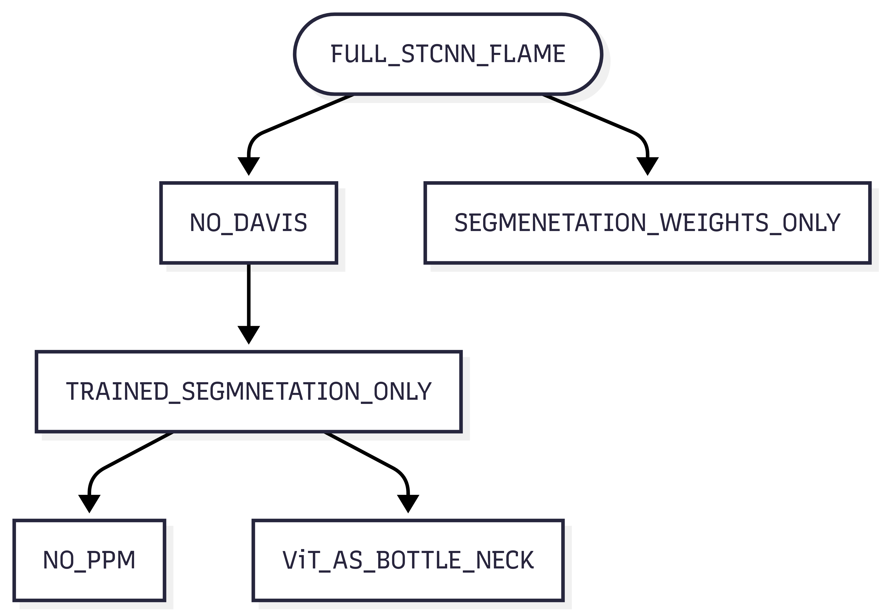

## Intermediate Results

- STCNN_FIRE (All pre-training and FLAME)

 | Parameters/ Metrics for FLAME | IoU | Pixel Accuracy  | 
 | ---- | ---- | ---- | 
 | 30 Epoch | 68% | 99% | 
 | 50 Epoch  | 69% | 99% | 

Example Predictions for this model:

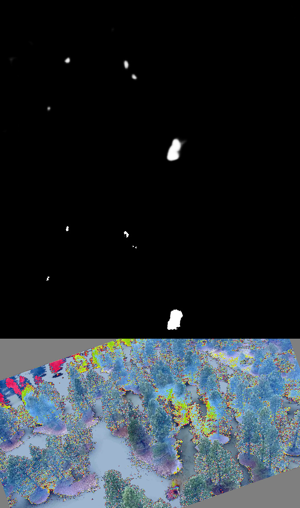

- STCNN_FIRE (No Temporal, just Segmentation weights)

 | Parameters/ Metrics for FLAME | IoU | Pixel Accuracy  | 
 | ---- | ---- | ---- | 
 | No additional Training | 22% | 99% | 

### STCNN_FIRE (No Temporal, No DAVIS, Pre_training with FLAME)

 

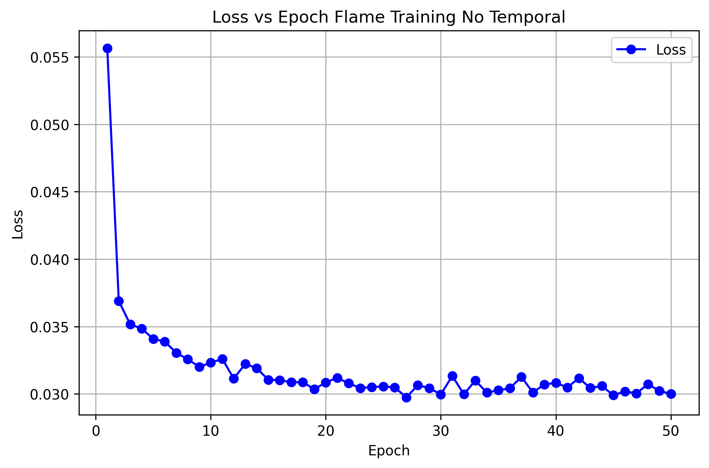

[//]: # (column_list is not supported)

	[//]: # (column is not supported)

		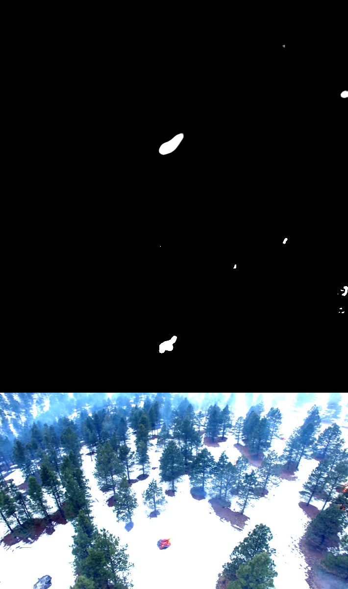

	[//]: # (column is not supported)

		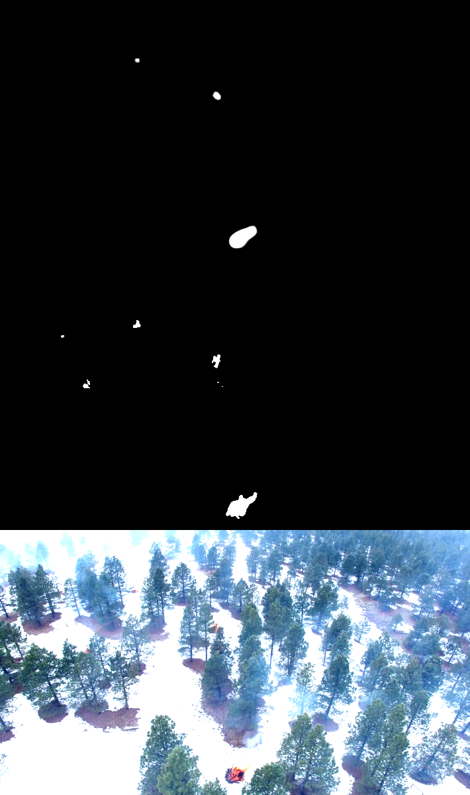

	[//]: # (column is not supported)

		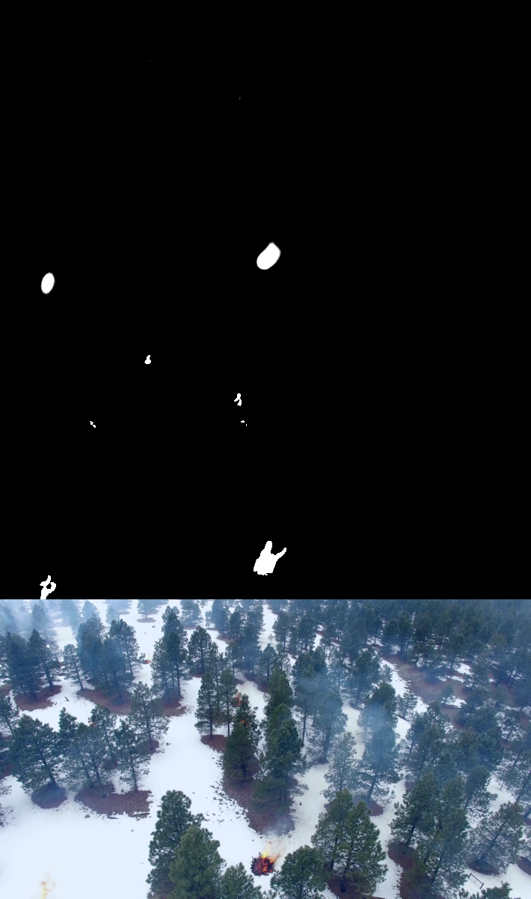

 | Parameters/ Metrics for FLAME | IoU | Dice | Pixel Accuracy  | 
 | ---- | ---- | ---- | ---- | 
 | FLAME Training | 53% | 69% | 99% | 

 | Training process  | time | iter | 
 | ---- | ---- | ---- | 
 | Segmentation Pre-training | 27min | 12000 | 
 | FLAME Training | 42min | 50 ep | 

### STCNN_FIRE (No Temporal, No DAVIS, No PPM, with FLAME)

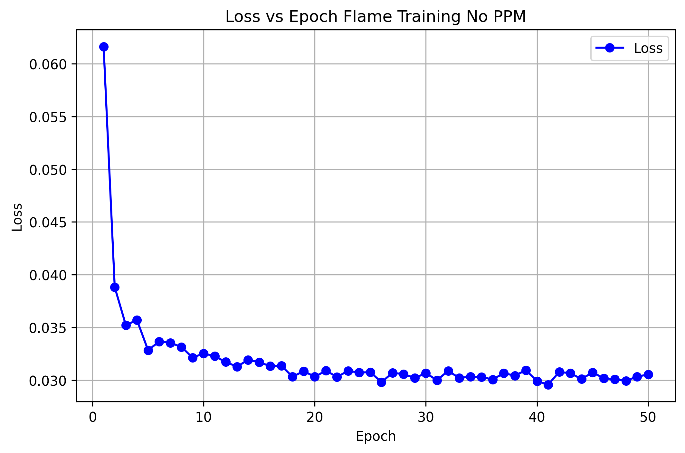

[//]: # (column_list is not supported)

	[//]: # (column is not supported)

		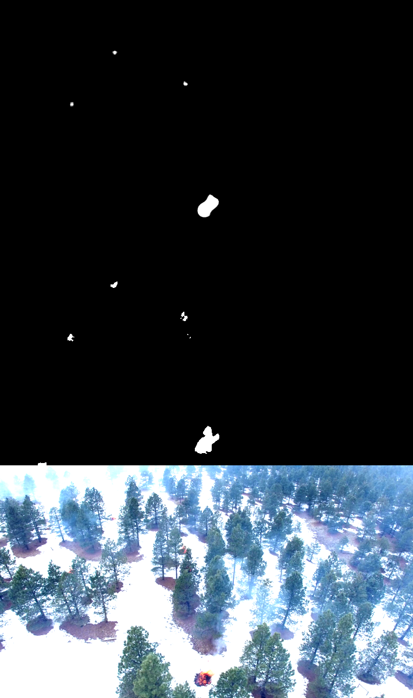

	[//]: # (column is not supported)

		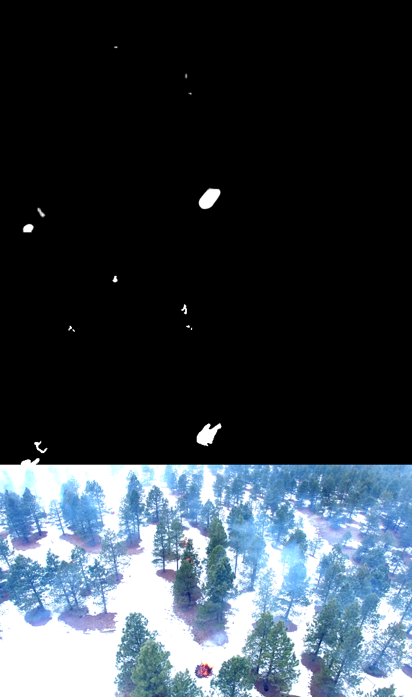

	[//]: # (column is not supported)

		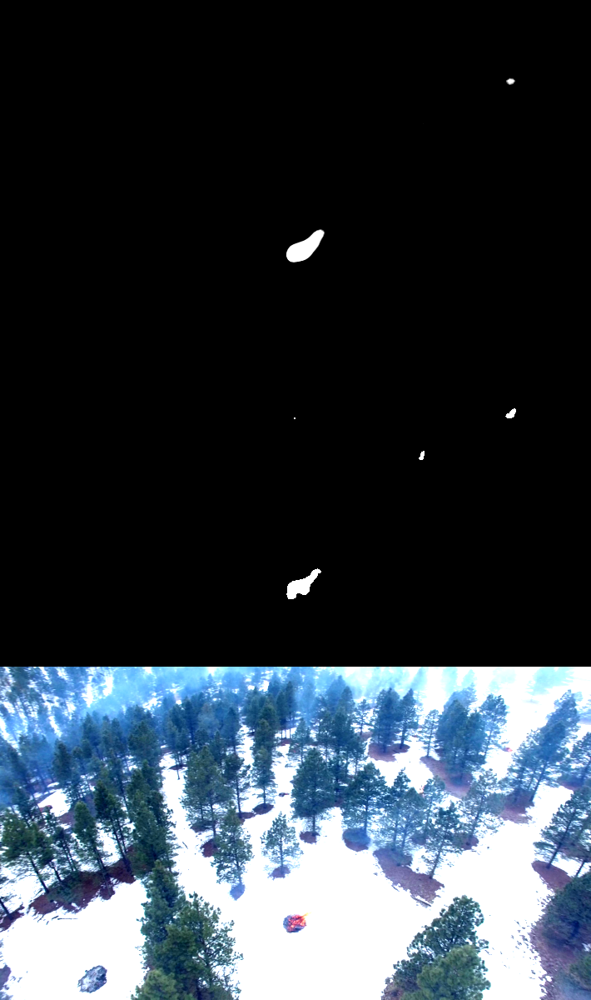

		 

 | Parameters/ Metrics for FLAME | IoU | Dice | Pixel Accuracy  | 
 | ---- | ---- | ---- | ---- | 
 | FLAME Training 50 epochs | 55% | 71% | 99% | 

 | Training process  | time | iter | 
 | ---- | ---- | ---- | 
 | Segmentation Pre-training | 27min | 12000 | 
 | FLAME Training | 1h 10min | 50 ep | 

From observed results, it appears that PPM as attention module is not very feasible for the type of data that we would like to segment, potentially need to seek other methods of bottleneck or structure with no bottleneck attention.

### General FIRE Dataset testing (No-pretraininig)

Does not capture good results outside of the similar environment (something with contrasting background). A lot of False positives with somewhat of a red pixels in the picture. 

 

***The masks are actually true and original ground truth of the dataset!!! Thus ground truth masking cannot be used for training due to it’s horrendous quality of labeling.***

 

[//]: # (column_list is not supported)

	[//]: # (column is not supported)

		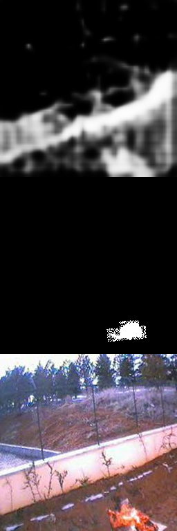

	[//]: # (column is not supported)

		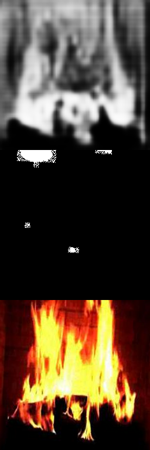

	[//]: # (column is not supported)

		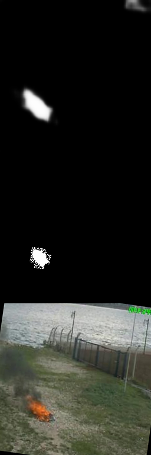

	[//]: # (column is not supported)

		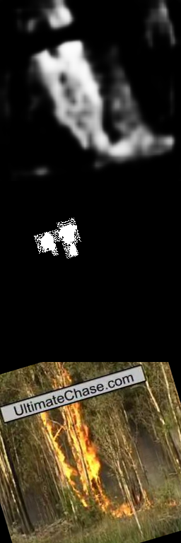

 

## Current Tasks and Goals

- [ ] Complete and Test Lucid Dream Augmentation

- [x] Isolate Temporal Branch, test and compare

- [x] Prepare FIRE Dataset

	- 

	[//]: # (child_page is not supported)

- [x] Run Model on FIRE Dataset, assess the robustness

	- Model recognizes basic patters and is able to distinguish fire in background with forests

	- However, gets a ton of False Positives when the background changes

- [x] Add more relevant Metrics (Maybe??)

- [x] Refactor the code, and commit on Git

- [x] Test without PPM

	- Showed to be not effective for the task

 

 

 

